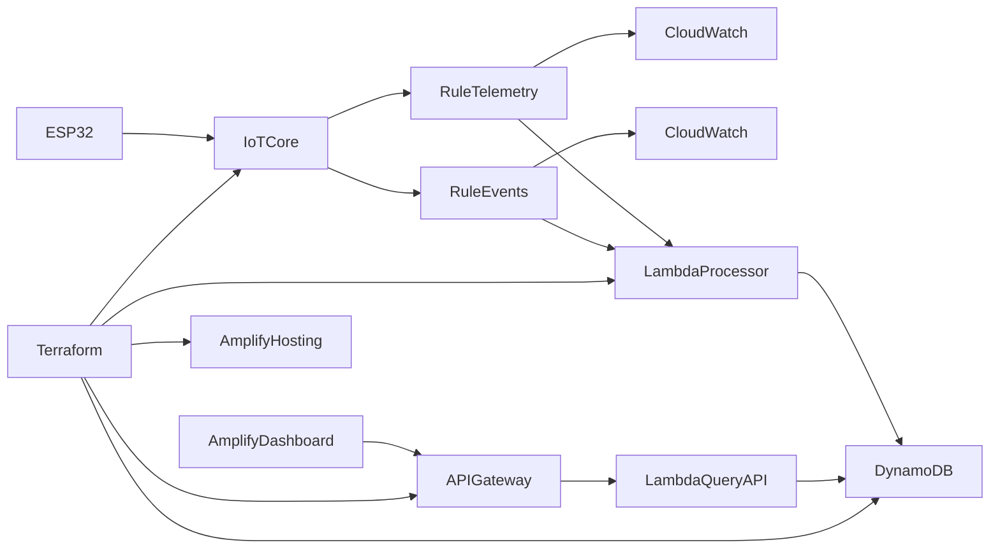

# ESP32 AWS IoT Demo — Kiro Spec Index

Master index for the 3-phase specification. Each phase uses the same structure: `requirements.md`, `design.md`, `tasks.md`.

Configuration: [.config.kiro](.config.kiro)

## Phases

| Phase | Status | Scope | Requirements | Design | Tasks |
|-------|--------|-------|--------------|--------|-------|
| **1** | ACTIVE | Device + IoT baseline | [phase-1/requirements.md](phase-1/requirements.md) | [phase-1/design.md](phase-1/design.md) | [phase-1/tasks.md](phase-1/tasks.md) |
| **2** | IMPLEMENTED | Serverless ingest (Lambda + DynamoDB + Terraform) | [phase-2/requirements.md](phase-2/requirements.md) | [phase-2/design.md](phase-2/design.md) | [phase-2/tasks.md](phase-2/tasks.md) |
| **3** | IN PROGRESS | API + Amplify dashboard | [phase-3/requirements.md](phase-3/requirements.md) | [phase-3/design.md](phase-3/design.md) | [phase-3/tasks.md](phase-3/tasks.md) |

## Stable Contracts (all phases)

These are defined in Phase 1 and must not change:

| Contract | Value |
|----------|-------|
| Telemetry topic | `devices/{Thing_Name}/telemetry` |
| Events topic | `devices/{Thing_Name}/events` |
| Payload base fields | `device_id`, `ts`, `type` |

## Phase Gates

| Gate | Pass criteria |
|------|---------------|
| **Phase 1** | Firmware builds; device publishes telemetry + events; IoT Rules route to CloudWatch |
| **Phase 2** | ESP32 publish → Lambda → DynamoDB row; CloudWatch path still works |
| **Phase 3** | Browser dashboard loads from Amplify; shows data via Query API |

## Target Architecture (end state)

## Execution Order

1. Complete Phase 1 (active spec in `phase-1/`)
2. Expand Phase 2 skeleton → implement serverless ingest
3. Expand Phase 3 skeleton → implement API + dashboard
