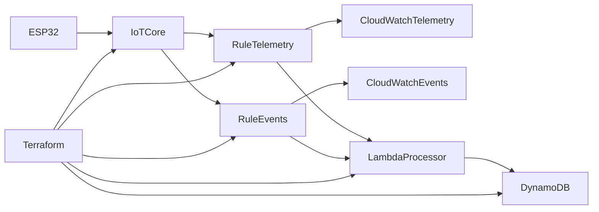

# Design Document — Phase 2: Serverless Ingest

> **Status:** IMPLEMENTED IN REPO — runtime gate validation pending.

## Overview

Phase 2 adds serverless ingest to the Phase 1 architecture. IoT Rules fan out to both CloudWatch (existing verification path) and a Lambda processor that writes normalized records to DynamoDB. All shared AWS resources are owned by Terraform under `terraform/`.

**Depends on:** [Phase 1 design](../phase-1/design.md), [Phase 2 requirements](./requirements.md)

**Master index:** [README.md](../README.md)

## Stable Contracts

Reference only — do not modify in Phase 2:

| Contract | Value |
|----------|-------|
| Telemetry topic | `devices/{Thing_Name}/telemetry` |
| Events topic | `devices/{Thing_Name}/events` |
| Telemetry rule SQL | `SELECT * FROM 'devices/+/telemetry'` |
| Events rule SQL | `SELECT * FROM 'devices/+/events'` |
| Payload base fields | `device_id`, `ts`, `type` |

## Architecture

### Data Flow

1. ESP32 publishes JSON to telemetry or events topic (unchanged from Phase 1).
2. IoT Rule evaluates SQL and triggers **both** CloudWatch and Lambda actions.
3. Lambda validates base fields, normalizes record, writes to DynamoDB.
4. CloudWatch continues to receive raw payloads for operator verification.

## Terraform Module Boundaries

Modules are skeleton contracts — implementation deferred until Phase 2 execution.

### `terraform/modules/iot_rule_fanout`

| Direction | Name | Description |
|-----------|------|-------------|
| Input | `telemetry_topic_pattern` | SQL topic filter for telemetry rule |
| Input | `events_topic_pattern` | SQL topic filter for events rule |
| Input | `cloudwatch_telemetry_arn` | CloudWatch action target for telemetry |
| Input | `cloudwatch_events_arn` | CloudWatch action target for events |
| Input | `cloudwatch_error_arn` | Error action log group |
| Input | `lambda_processor_arn` | Lambda function ARN for fan-out |
| Output | `telemetry_rule_name` | Created telemetry rule identifier |
| Output | `events_rule_name` | Created events rule identifier |
| Output | `telemetry_rule_arn` | Telemetry rule ARN |
| Output | `events_rule_arn` | Events rule ARN |

### `terraform/modules/lambda_processor`

| Direction | Name | Description |
|-----------|------|-------------|
| Input | `telemetry_table_name` | DynamoDB table for telemetry records |
| Input | `events_table_name` | DynamoDB table for event records |
| Input | `environment` | Environment prefix (e.g., `dev`) |
| Output | `function_arn` | Lambda function ARN |
| Output | `function_name` | Lambda function name |
| Output | `invoke_role_arn` | IAM role ARN for IoT Rule invocation |

### `terraform/modules/dynamodb`

| Direction | Name | Description |
|-----------|------|-------------|
| Input | `environment` | Environment prefix for table naming |
| Input | `billing_mode` | `PAY_PER_REQUEST` or provisioned `[TBD]` |
| Output | `telemetry_table_name` | Telemetry table name |
| Output | `telemetry_table_arn` | Telemetry table ARN |
| Output | `events_table_name` | Events table name |
| Output | `events_table_arn` | Events table ARN |

## Data Model

`[TBD: choose at implementation time]`

| Option | Pros | Cons |
|--------|------|------|
| Dual tables (`telemetry`, `events`) | Simple queries per type | Two schemas to maintain |
| Single table with `type` discriminator | One module, flexible | GSI design for type-specific queries |

**Provisional key model:**

- Partition key: `device_id` (string, matches `Thing_Name`)
- Sort key: `ts` (number, Unix seconds) with fallback when `ts=0` `[TBD: use ingest_ts or uptime_s]`
- Attributes: full payload fields + `record_type` (`telemetry` | `event`)

## Bootstrap Boundary

| Concern | Owner | Notes |
|---------|-------|-------|
| Per-device Thing + cert + policy | Bootstrap scripts (`scripts/configure.sh`, `aws/provision.sh`) | Terraform not suited for private key → header flow |
| Shared infra (rules, Lambda, DDB) | Terraform | Source of truth for cloud resources |
| Firmware headers (`config.h`, `certs.h`) | Bootstrap scripts | Consume Terraform outputs for endpoint `[TBD: table names if needed]` |

Phase 1 artifacts under `aws/rules/*.json` become **import/reference targets** for Terraform during migration, not the long-term source of truth.

## Phase 2 Gate

Phase 2 is complete when:

1. `terraform apply` provisions ingest stack in target environment.
2. ESP32 telemetry publish → DynamoDB row verifiable (CLI or console).
3. ESP32 event publish → DynamoDB row verifiable.
4. CloudWatch logs still receive both payload types.
5. Phase 1 operator workflow documented with Terraform-first steps.

## Out of Scope

- API Gateway, query Lambda, Amplify (Phase 3)
- Authentication/authorization for data access (Phase 3)
- Firmware feature additions beyond contract stability
