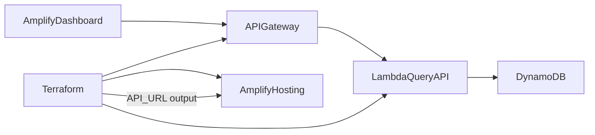
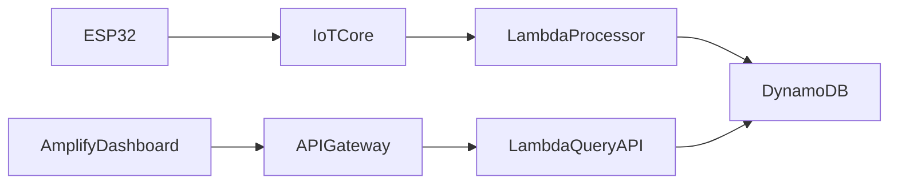

# Design Document — Phase 3: API + Amplify Dashboard

> **Status:** IMPLEMENTED IN REPO — runtime gate validation pending.

## Overview

Phase 3 completes the demo platform with a read-only HTTP API and a static dashboard on AWS Amplify. API Gateway invokes a query Lambda that reads from Phase 2 DynamoDB tables. Terraform outputs the API base URL for Amplify build-time configuration.

**Depends on:** [Phase 2 design](../phase-2/design.md), [Phase 3 requirements](./requirements.md)

**Master index:** [README.md](../README.md)

## Stable Contracts

API and dashboard consume records written by Phase 2 using Phase 1 semantics:

| Field | Source | API usage |
|-------|--------|-----------|
| `device_id` | Payload / Thing name | Path parameter `{deviceId}` |
| `ts` | Payload Unix seconds | Sort/filter for latest and recent |
| `type` | Payload discriminator | Filter telemetry vs events |

## Architecture



### End-to-End Flow (all phases)



## Terraform Module Boundaries

Modules are skeleton contracts — implementation deferred until Phase 3 execution.

### `terraform/modules/lambda_query_api`

| Direction | Name | Description |
|-----------|------|-------------|
| Input | `telemetry_table_arn` | Read access to telemetry table |
| Input | `events_table_arn` | Read access to events table |
| Input | `environment` | Environment prefix |
| Output | `function_arn` | Query Lambda ARN |
| Output | `function_name` | Query Lambda name |
| Output | `invoke_role_arn` | IAM role for API Gateway invocation |

### `terraform/modules/api_gateway`

| Direction | Name | Description |
|-----------|------|-------------|
| Input | `lambda_query_arn` | Query Lambda to integrate |
| Input | `cors_allow_origins` | Amplify app origin(s) |
| Input | `environment` | Environment prefix |
| Output | `api_id` | API Gateway identifier |
| Output | `invoke_url` | Base URL for dashboard (includes stage) |
| Output | `stage_name` | Deployed stage name |

### `terraform/modules/amplify_hosting`

| Direction | Name | Description |
|-----------|------|-------------|
| Input | `repository_url` | Git repository for Amplify app `[TBD: monorepo path]` |
| Input | `branch_name` | Branch to deploy (e.g., `main`) |
| Input | `api_base_url` | From `api_gateway` module output |
| Input | `build_env_var_name` | e.g., `VITE_API_URL` |
| Output | `app_id` | Amplify app identifier |
| Output | `app_url` | Default Amplify hosting URL |
| Output | `default_domain` | Amplify-managed domain |

## API Contract Sketch

`[TBD: OpenAPI specification at implementation time]`

| Method | Path | Description |
|--------|------|-------------|
| GET | `/devices/{deviceId}/telemetry/latest` | Most recent telemetry record for device |
| GET | `/devices/{deviceId}/events?limit=N` | Recent events, newest first, default limit `[TBD]` |

**Response shape (provisional):**

```json
{
  "device_id": "esp32-demo-001",
  "ts": 1710000000,
  "type": "connectivity",
  "data": { }
}
```

`data` contains type-specific fields from the stored payload.

## Dashboard Scope (MVP)

| View | Content | Data source |
|------|---------|-------------|
| Device header | `device_id`, last seen timestamp | Latest telemetry or event |
| Telemetry card | RSSI, uptime, heap, chip temp | `GET .../telemetry/latest` |
| Events list | Recent button events with timestamps | `GET .../events?limit=N` |

**Polling:** `[TBD: interval at implementation]` — simple periodic fetch for MVP; no WebSocket in Phase 3 skeleton.

**Auth:** `[TBD: auth strategy at implementation]` — MVP may use open read API behind obscurity; document before production use.

## Environment Wiring

```
Terraform apply
  → api_gateway.invoke_url output
  → amplify_hosting.api_base_url input
  → Amplify build env (VITE_API_URL or equivalent)
  → Dashboard fetch(`${API_URL}/devices/${id}/telemetry/latest`)
```

Operator must not hardcode API URLs in source; use build-time injection only.

## Phase 3 Gate

Phase 3 is complete when:

1. Amplify app URL loads dashboard in browser.
2. Dashboard displays latest telemetry and recent events for a publishing ESP32.
3. Full path documented: flash device → publish → DynamoDB → API → browser.
4. CORS configured so Amplify origin can call API Gateway.

## Out of Scope

- Write/delete API endpoints
- Real-time IoT Core subscription in browser
- User authentication and multi-device admin UI
- Mobile-native apps
