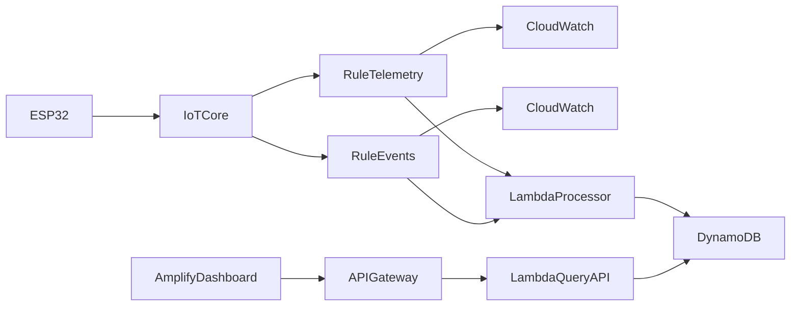

# Architecture

| Phase | Status | Components |
|-------|--------|------------|
| **1** | Implemented | `firmware/`, `aws/` bootstrap |
| **2** | Implemented | `terraform/` ingest (Lambda + DynamoDB) |
| **3** | Implemented | Query API, `web/` dashboard, Amplify |

Kiro specs: [.kiro/specs/esp32-aws-iot-demo/README.md](../.kiro/specs/esp32-aws-iot-demo/README.md)

## Data flow

1. Firmware: Wi-Fi → NTP → MQTT (TLS) → publish telemetry/events
2. IoT Rules → CloudWatch Logs + Lambda processor → DynamoDB
3. Dashboard → API Gateway → query Lambda → DynamoDB

## Firmware modules

| Module | Role |
|--------|------|
| `WiFiManager` | Connect + exponential retry |
| `NTPSync` | SNTP (30 s timeout; `ts=0` fallback) |
| `MQTTManager` | TLS MQTT, QoS 1 |
| `TelemetryPublisher` | Periodic connectivity payload |
| `EventPublisher` | GPIO0 BOOT button, debounced |
| `StatusLed` | Blue RGB flash on successful telemetry publish (S3 DevKitC-1) |
| `WatchdogSupervisor` | Task WDT + connectivity timeout reset |
| `Logger` | Serial `[millis][tag] message` |

Payload contract: [PAYLOAD.md](PAYLOAD.md)

## Cloud

- **Per device:** Thing, cert, policy — `aws/provision-device.sh`
- **Shared infra:** Terraform (`terraform/`) — IoT Rules, Lambda, DynamoDB, API Gateway, Amplify

Operator steps: [WALKTHROUGH.md](WALKTHROUGH.md)
